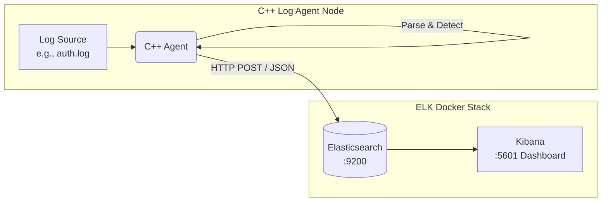

# C++ Basic SIEM Prototype

This repository contains the architecture and implementation plan for building a minimal SIEM-like system. The goal is to collect logs from a custom C++ agent, analyze them for simple security events, and forward them to Elasticsearch and Kibana for visualization.

## 1. Architecture Diagram



**Pipeline Flow:**
1. **C++ Log Agent** runs as a daemon/background process, tailing a specified log file.
2. It parses each line and uses local rule logic to detect events like failed logins, multiple attempts, or suspicious IPs.
3. Detected security events are aggregated and transformed into JSON.
4. The agent pushes the JSON payload to **Elasticsearch** via an HTTP REST API using `libcurl`.
5. **Kibana** queries and visualizes this data in real-time.

*(Optional)*: If using **Filebeat**, the C++ agent would write JSON logs to a local file, and Filebeat would be configured to ship them to Elasticsearch. For this beginner-friendly prototype, sending directly via HTTP from C++ is recommended to reduce moving parts.

## 2. Project Layout

```text
siem-project/
├── agent/                  # C++ agent source code
│   ├── src/                # C++ source files
│   ├── include/            # Header files
│   └── CMakeLists.txt      # Build configuration
├── docker/                 # Docker configuration for ELK stack
│   └── docker-compose.yml
├── configs/                # Configuration files (Agent settings, Optional Filebeat)
│   └── agent_config.json
├── dashboards/             # Exported Kibana dashboard NDJSON files
├── docs/                   # Additional documentation and design specs
│   └── agent_design.md
└── README.md               # This file
```

## 3. Implementation Plan: Step-by-Step

**Phase 1: Environment Setup**
- [ ] Install Docker and Docker Compose.
- [ ] Spin up the `docker-compose.yml` in the `docker/` folder.
- [ ] Verify Elasticsearch is running at `http://localhost:9200` and Kibana at `http://localhost:5601`.

**Phase 2: Log Agent Scaffolding (C++)**
- [ ] Implement a CMake project in the `agent/` folder.
- [ ] Include dependencies: `nlohmann/json` (header-only) and `libcurl`.
- [ ] Write a simple file tailing function that continuously reads new lines from a dummy `auth.log`.

**Phase 3: Parsing and Detection Logic**
- [ ] Implement string matching or regex to parse log lines (e.g., matching "Failed password for...").
- [ ] Build a stateful tracker in C++ (like a `std::map<std::string, int>` for tracking failed attempts per IP within a timeframe).
- [ ] Implement Rules 1, 2, and 3 (see Detection Logic section). 

**Phase 4: Data Formatting and Ingestion**
- [ ] On rule trigger, populate a C++ `struct` representing the security event.
- [ ] Serialize the struct to JSON using `nlohmann/json`.
- [ ] Use `libcurl` to `POST` the JSON string to Elasticsearch (`http://localhost:9200/siem-events/_doc/`).

**Phase 5: Visualization**
- [ ] Open Kibana and create a Data View (Index Pattern) for `siem-events*`.
- [ ] Build a dashboard to map metrics (Failed Logins, Top IPs, Events per minute).
- [ ] Save and export the dashboard to `dashboards/`.

## 4. Log Schema

Each security event generated by the C++ agent will adhere to the following JSON schema before being sent to Elasticsearch:

```json
{
  "timestamp": "2024-03-08T10:15:30Z",
  "host": "server1",
  "event_type": "brute_force_attempt",
  "source_ip": "192.168.1.50",
  "target_user": "root",
  "severity": "high",
  "message": "More than 5 failed logins detected within 1 minute from 192.168.1.50"
}
```

## 5. Detection Logic (Rules)

The C++ agent will implement simple rules to detect malicious activity directly at the endpoint:

- **Rule 1: Brute Force Detection**
  - **Condition:** If `failed_login_count` > 5 for the same `source_ip` within a rolling 60-second window.
  - **Action:** Generate `brute_force_attempt` event, Severity: `high`.
- **Rule 2: Known Malicious IP Block**
  - **Condition:** If connection or login attempt matches an IP on a predefined blocklist (loaded from `configs/`).
  - **Action:** Generate `blocked_ip_access`, Severity: `critical`.
- **Rule 3: File Integrity Monitor (FIM) Simulation**
  - **Condition:** If the log indicates a specific critical file was modified (e.g., `/etc/shadow`).
  - **Action:** Generate `suspicious_file_modification`, Severity: `high`.

## 6. Kibana Dashboard Setup

In Kibana, to visualize the collected SIEM data:
1. **Data View:** Create a data view matching the index `siem-events*`.
2. **Visualizations:**
   - **Failed Logins (Metric/Goal):** A single distinct counter showing the total number of authentication failures.
   - **Top Attacking IPs (Pie Chart/Table):** Aggregation bucketed by `source_ip` terms descending by count.
   - **Events Over Time (Bar Chart):** Date histogram on `timestamp` with a split series by `event_type` to show events per minute.
   - **Alert Log (Data Table):** A raw table showing the most recent high-severity events and their `.message` fields.

## 7. Future Improvements
- **Filebeat Integration:** Instead of standard HTTP calls, output to a structured `.json` log file and use Filebeat for robust, batched delivery with retries.
- **TLS/Authentication:** Re-enable `xpack.security` and switch the C++ agent to use HTTPS with API tokens.
- **Dynamic Rules:** Allow the C++ agent to hot-reload rules from an external JSON/YAML file instead of hardcoding conditions.
- **Memory Optimization:** Implement Ring-buffers for the state trackers so the IP list doesn't inflate memory usage over time.

## 8. Testing the SIEM

Once the Docker containers are running (`docker compose up -d`), the C++ agent will listen for changes to the file `logs/test_auth.log`. You can simulate attacker behavior by echoing fake log strings directly into this file from your terminal.

**1. Test a Standard Failed Login**
```bash
echo "Dec 10 11:00:00 server sshd[124]: Failed password for fake_admin from 8.8.8.8 port 22" >> ~/Developer/ELK/siem-project/logs/test_auth.log
```
* **What to expect in Kibana:** Go to "Discover" and filter by the Last 15 minutes. You will see a `failed_login` event with a `medium` severity for IP `8.8.8.8`.

**2. Test a Known Blocked IP (Rule 2)**
The C++ agent statically blocks IPs `10.0.0.50` and `192.168.100.100`. Simulating a login from one of these will trigger a critical alert.
```bash
echo "Dec 10 11:00:00 server sshd[124]: Failed password for fake_admin from 10.0.0.50 port 22" >> ~/Developer/ELK/siem-project/logs/test_auth.log
```
* **What to expect in Kibana:** A new event pops up instantly with `event_type: blocked_ip_access` and `severity: critical`.

**3. Test a Brute Force Attack (Rule 1)**
The agent tracks when 5 or more failures come from the same IP. We can use a fast bash loop to write 5 logs at once.
```bash
for i in {1..5}; do
  echo "Dec 10 11:05:00 server sshd[124]: Failed password for test_user from 55.55.55.55 port 22" >> ~/Developer/ELK/siem-project/logs/test_auth.log
done
```
* **What to expect in Kibana:** You will see 4 normal `failed_login` events, and the 5th one will escalate to `event_type: brute_force_attempt` and `severity: high`.


mkdir -p siem-project/agent/include 
curl -sSL -o siem-project/agent/include/json.hpp https://github.com/nlohmann/json/releases/download/v3.11.2/json.hpp
